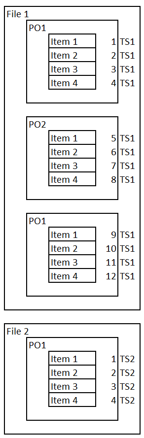
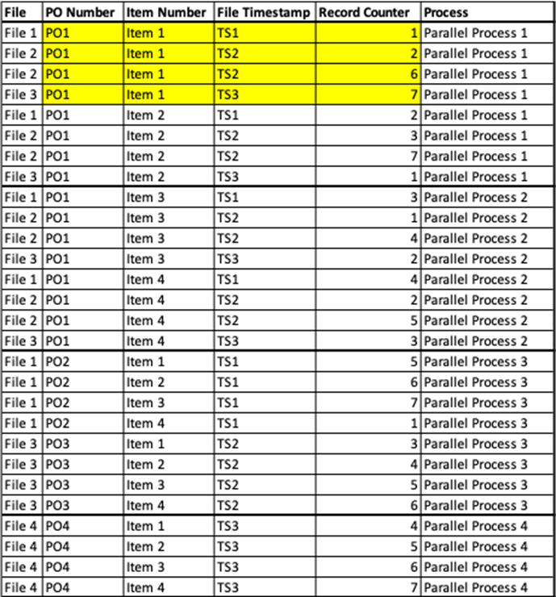

## SAP duplicated records reconciliation  

For some of the data extraction there might be situation where one e.g. purchase order will have multiple values for the same item if changed within interval of data extraction periodicity. To address this topic we have developed simple lambda function that will add additional column to S3 extracted JSON file with counter and timestamp what can be then easily reconciled with SQL and last record selected

In order to ensuring records are processed in the right order, the timestamp and record number are used to sort the records with common key (PO Number and Item Number in this example) . The process that reads the extracted data needs to ensure all records for a given key combination are selected in the same process, in case of parallel processing. In the example below, all records for the same key are included in the same package and sorted by Timestamp & Record number, to ensure the last record that was extracted is the final value that is updated in the target.

Duplicate records example \

Records after added record counter column \

## Pre-requisites

S3 bucket with extracted SAP data.
   
## Deployment Steps

1) Create new lambda function with python 3.12 and adjust the timeout to at least 5 min
2) Make sure Lambda is created in specific VPC
3) Within glue_client code line adjust to proper AWS region where your deployment will take place
4) Adjust the Lambda IAM role and add inline policies for S3 read write access to bucket
6) Define following Lambda environment variables
   1) S3_BUCKET - define in which S3 bucket the extracted data are located
7) Adjust the source_prefix, archived_prefix and target_prefix to your specific sub directories needs
8) Create trigger in Lambda function with source S3 , bucket name with extracted SAP data and event types s3:ObjectCreated:*
10) Validate results in the CloudWatch Log Stream