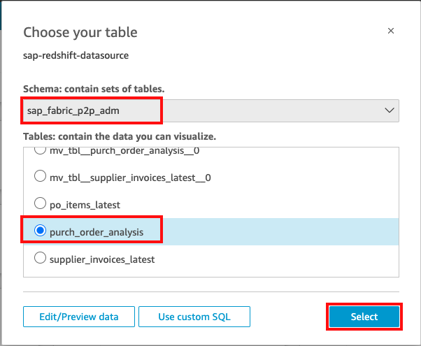
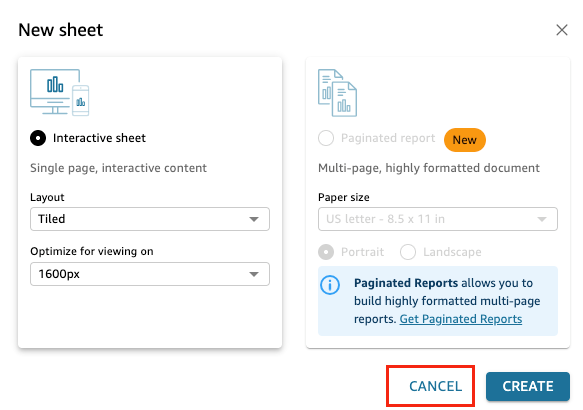

# Creating a Dataset in Amazon QuickSight

1.  From Amazon QuickSight initial screen, select **Datasets** and then click **New dataset** from up right corner.

2.  Scroll down to **FROM EXISTING DATA SOURCES** section, and then click **sap-redshift-datasource** 

3.  Click **Create data set**

4.  Select 'Schema' **sap_fabric_p2p_adm**, select 'Tables' **purch_order_analysis** and then click **Select**

5.  To finish the dataset creation, confirm that the **Import to SPICE for quicker analytics** is selected and click **Visualize**

6. Under the **New sheet** dialog box, select **CANCEL**, so you can manually create your dashboard with Generative BI support. 

7. Select the **QuickSight logo** on the top left corner to go back to the Amazon QuickSight initial screen.

