# Creating a Topic from this Dataset and get insight to the data

1.  From Amazon QuickSight initial screen, select **Topics** (1) and then click **NEW TOPIC** (2). 

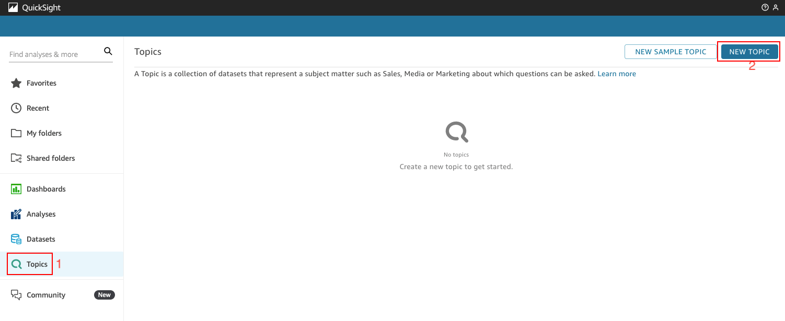

2.  Under the New topic dialog box, use :code[SAP Procurement Data]{showCopyAction=true} as Topic name and select **CONTINUE**.

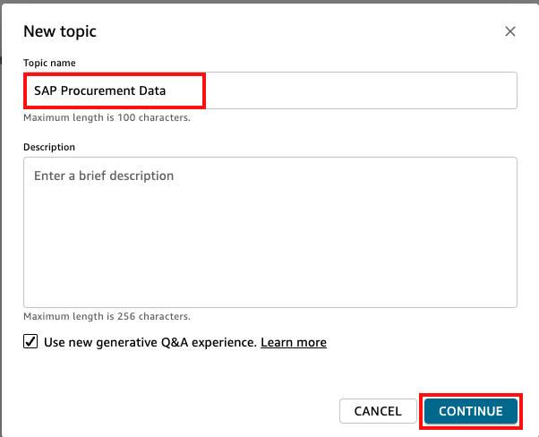

3.  Under **Select a dataset** dialog box, select the previously created dataset **purch_order_analysis** and click **CREATE**

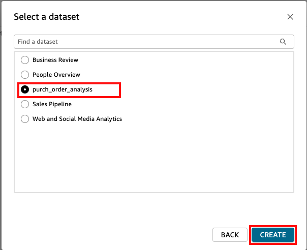

::alert[It may take up to 3 minutes minutes to create the topic]

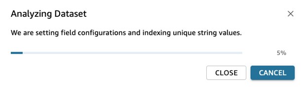

Once it’s created, you will see the **SAP Procurement Data** Topic Summary.

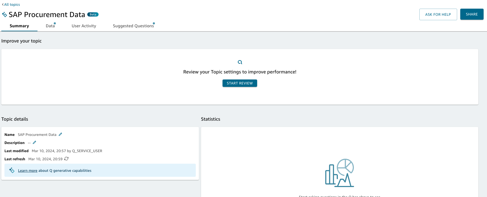

4.  On the **SAP Procurement Data** topic details, select **Data** tab 

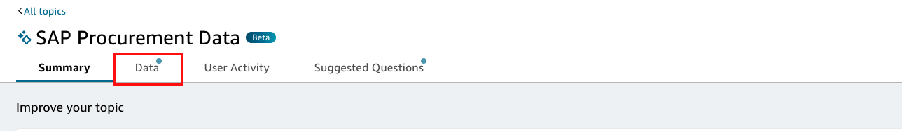

5. Under **DATA FIELDS**, include the fields below into the Topic (**toggle on each of them**) and **add/remove synonyms** accordingly:

- Include **Invoice Amount** field, no additional synonym is necessary.
- Include **Material Group** field, no additional synonym is necessary.
- Into the already included **Material Matnr** field, add *material* as synonym.
- Include **Purchasing Doc** field, no additional synonym is necessary.

With the required steps performed, the Orders Topic details view should look like this:

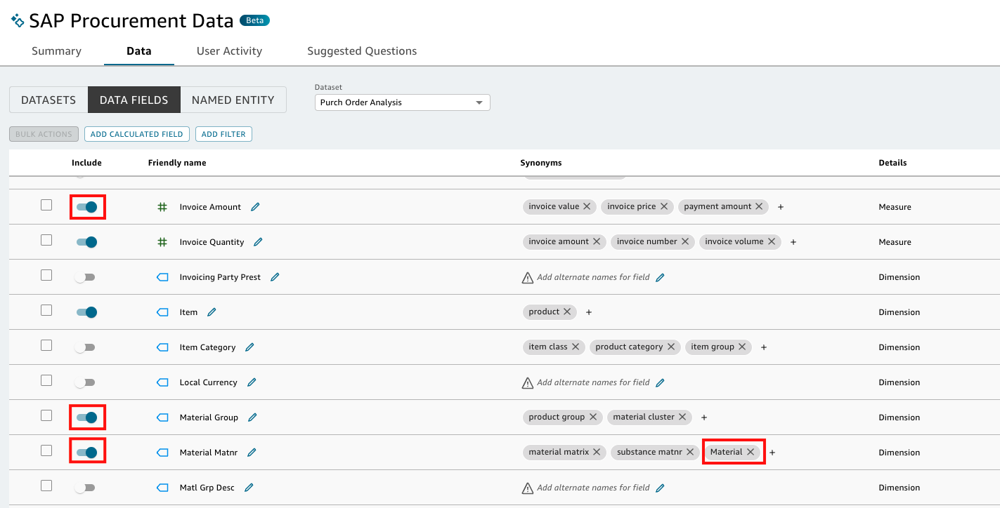

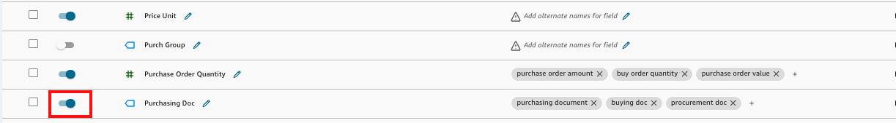

6. Now you can start asking Q some vendor invoice related questions using the synonyms that you adjusted, let’s check how it goes. On the SAP Procurement Data topic box on the top, using native language.

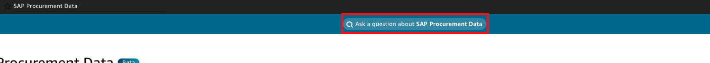

 ::alert[At this point, you don’t need to mark, share or link the results to your dashboard.]

7. Ask Q about *What is the quarterly invoice amount?* and press Enter. You should see the results as shown below:

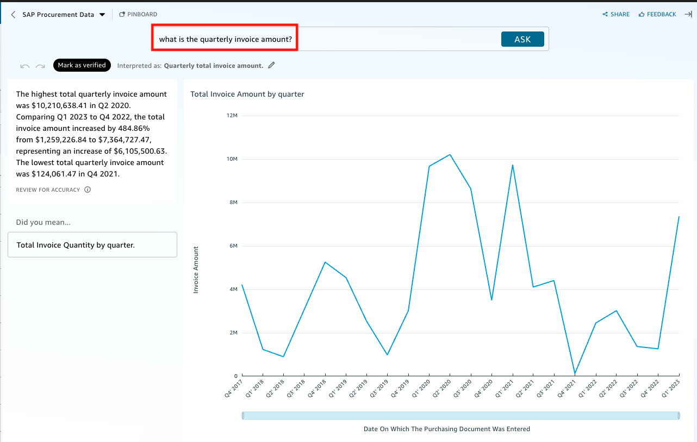

8. Now ask Q about *Why did invoice amount increase Q1 2023?* and press Enter. You should see the results as shown below:

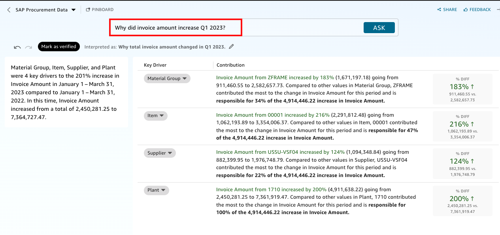

9. Now ask Q about *What are the top 5 suppliers by net price for in 2023?* and press Enter. You should see the results as shown below:

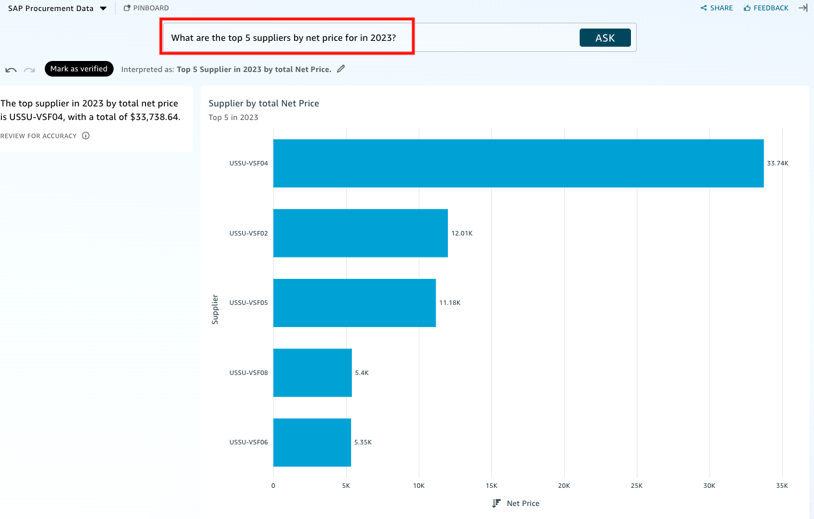

10. To finish your test, ask Q about *What is breakdown of net cost by material group?* and press Enter. You should see the results as shown below:

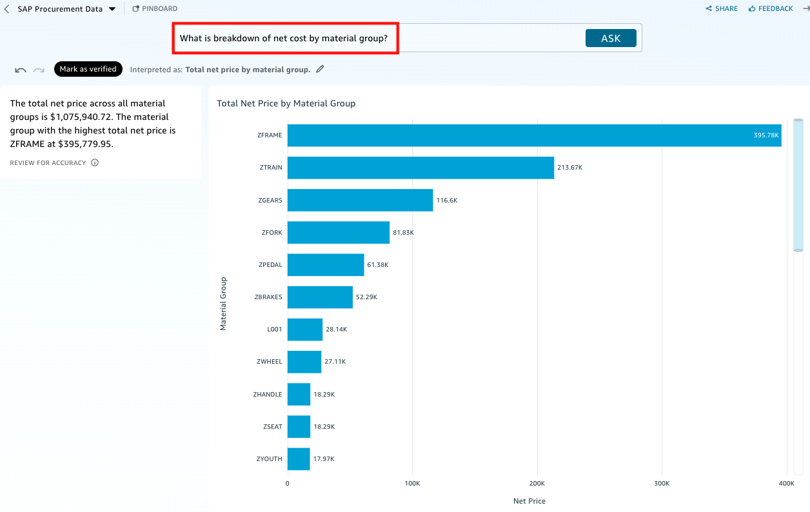

As you were able to see, you could get insights to vendor invoice data using generative AI based queries and able drill down to find reasons for increase in invoice amount. 

Now let's proceed to build out your analysis dashboard, using Generative BI capabilities. For that, select the **QuickSight logo** on the top left corner to go back to the Amazon QuickSight initial screen.
