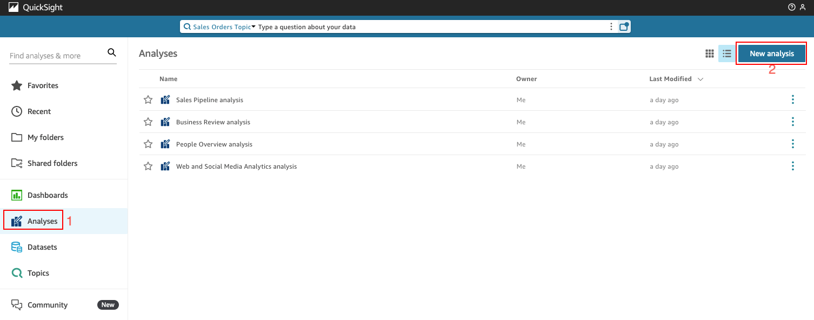
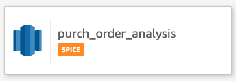
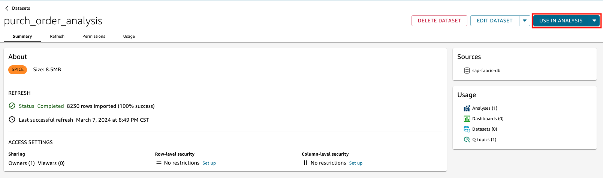
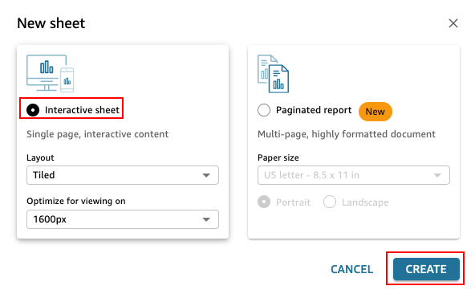
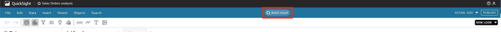
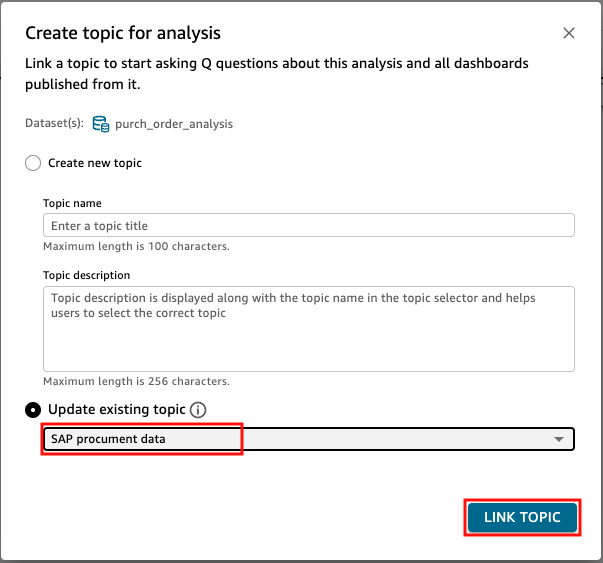

# Creating a Analysis on this Topic

1.  From Amazon QuickSight initial screen, select **Analyses** and then click **New analysis** from up right corner.

2. Then select the dataset created at the begining of the workshop (**purch_order_analysis**) to be added to your analysis.

1. On the **purch_order_analysis** dataset Summary, select **USE IN ANALYSIS**.

4.  Under the **New sheet** dialog box, keep the **Interactive sheet** selection and click **CREATE**.

::alert[If **Improved way to build visuals** or **Before you go** popup appears, you can **DISMISS ALL**.]

5.  To link this analysis with the previously created topic, select **Build visual** from the center of the screen. 

1.  Under update existing **Create topic for analysis**, select the (**SAP procurement data**) (1) from the **Update existing topic** dropdown option and click **LINK TOPIC** (2).

You will see the following success message on the top of the right corner. 

**SAP procurement data Topic is successfully linked.**
