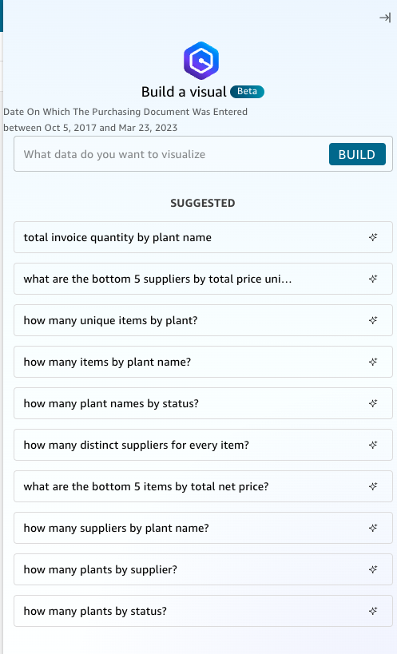
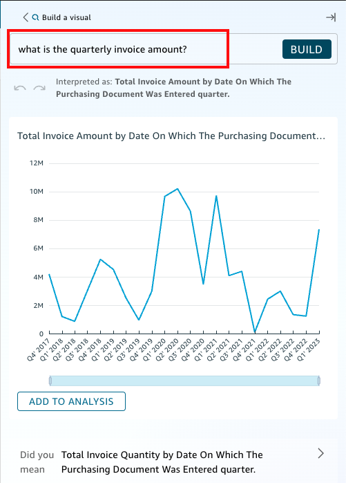
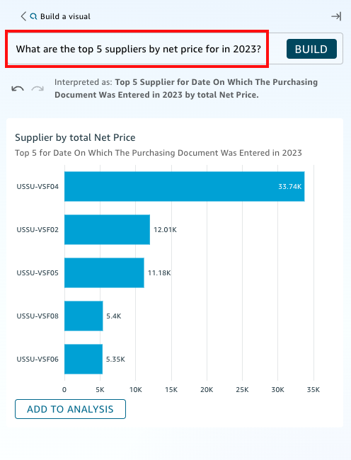
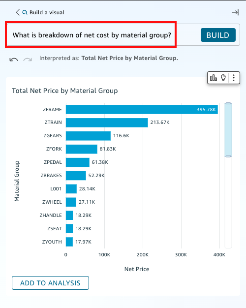

# Creating a Dashboard using Generative BI support

1.  Now, let’s start building your analysis using Generative BI. To do that, select **Build visual** again to open the Ask Q - Build a visual (Beta) interface.

2.  Let’s generate your first visual. Ask Q for the *What is the quarterly invoice amount?* and select **BUILD**

3.  Add this graph to your analysis by selecting **ADD TO ANALYSIS**

4.  Let’s generate another visual. Ask Q for the :*What are the top 5 suppliers by net price for in 2023?* and select **BUILD**

5.  Add this graph to your analysis by selecting **ADD TO ANALYSIS**

6.  Let’s generate another visual. Ask Q for the *What is breakdown of net cost by material group??* and select **BUILD**

7.  Add this graph to your analysis by selecting **ADD TO ANALYSIS**