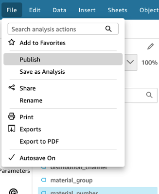
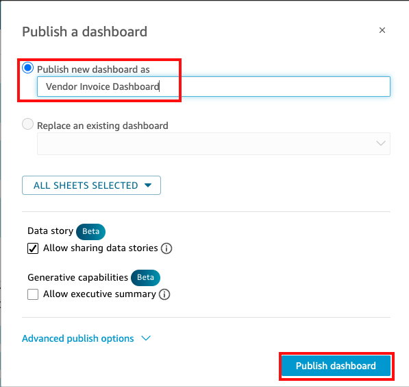

*Publishing the Dashboard

1.  Now that your dashboard is ready, let’s publish it. To do that, select **File** and then **Publish** from main Amazon QuickSight menu.

2.  Under **Publish a dashboard** dialog, enter the name :code[Vendor Invoice Dashboard]{showCopyAction=true} as new dashboard and select **Publish dashboard**. 

Once it’s published, it will open it automatically for visualization. You may also find it under Dashboards on the main QuickSight screen.