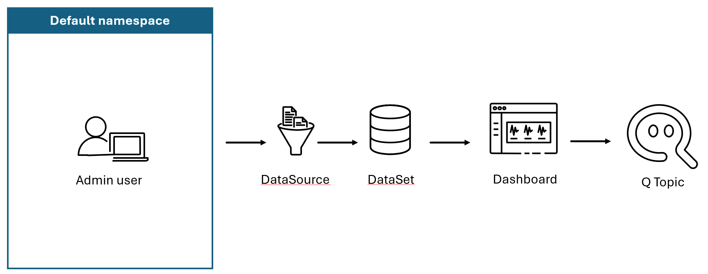

This section outlines steps on how to use QuickSight dashboard with Q capabilities

1) Creating Dataset in Amazon QuickSight
2) Create Topic and get insights to the data
3) Create an Analysis on the Topic
4) Create a Dashboard using Generative BI capabilities
5) Publish the Dashboard
