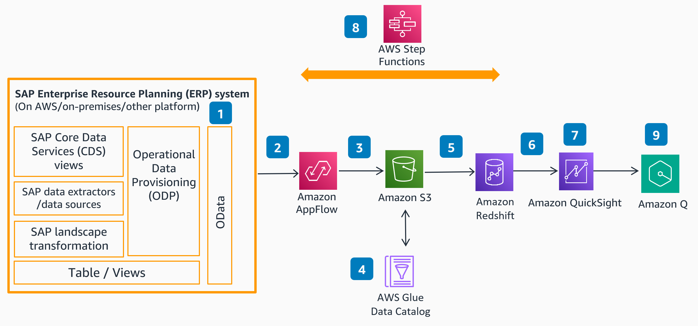
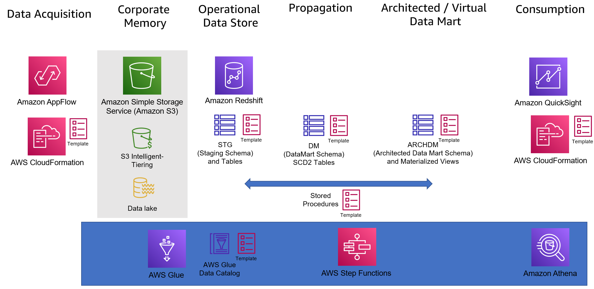

# Guidance for Data Warehousing Complementing SAP Solutions on AWS

## Table of Content (required)

- [Guidance for Data Warehousing Complementing SAP Solutions on AWS](#guidance-for-data-warehousing-complementing-sap-solutions-on-aws)
  - [Table of Content (required)](#table-of-content-required)
  - [Overview](#overview)
    - [Architecture](#architecture)
      - [Architecture components of the accelerators](#architecture-components-of-the-accelerators)
    - [Cost](#cost)
    - [Cost Table](#cost-table)
  - [Prerequisites](#prerequisites)
  - [Deployment Steps](#deployment-steps)
      - [Accelerator implementation steps](#accelerator-implementation-steps)
  - [Deployment Validation  (required)](#deployment-validation--required)
  - [Usage](#usage)
  - [Cleanup](#cleanup)
  - [Disclaimer](#disclaimer)
  - [Support](#support)
  - [Next steps](#next-steps)

## Overview 

AWS Analytics Fabric for SAP has been built to help accelerate SAP customer journeys to AWS Analytics and AI/ML services. These accelerators can be used as a baseline for development and be modified and customized as required specific to your SAP implementation.
Accelerators are provided by business process (for example, order to cash). Each accelerator includes Cloudformation templates for deployment of S3 buckets, AppFlow flows, Glue Data Catalog entries, and SQL scripts for deployment on Amazon Redshift.

### Architecture

1) Configure operational data provisioning (ODP) for extraction in the SAP Gateway of your SAP system.
2) Create the OData system connection from Amazon AppFlow to your SAP source system.  This is through AWS PrivateLink for SAP on AWS. You can connect with AWS via VPN/AWS Direct Connect, or over the internet.
3) In Amazon AppFlow, create the flow using the SAP source created in step 3.  Run the flow to extract data from SAP, and save it to an Amazon Simple Storage Service (Amazon S3) bucket.
4) Use an AWS Glue crawler to create a data catalog entry with metadata for the extracted SAP data in an Amazon S3 bucket.
5) Load data into Amazon Redshift through simple ‘COPY’ commands.  Model the data with other non-SAP sources in your data warehouse.
6) Create the dataset in Amazon QuickSight with Amazon Redshift as the data source.
7) Create a dashboard to visualize the business data as per user requirements. Use inbuilt ML and insight features to help enable speed to insight. 
8) Deploy AWS Step Functions for overall orchestration and alerting of your data pipelines and end to end process.
9) Use Generative BI with Amazon Q in QuickSight to get insight to data.

#### Architecture components of the accelerators

In data acquisition we are using an AWS CloudFormation template to deploy, activate and schedule data flows from your SAP system based on standard SAP Business content.
The data will be extracted into your S3 bucket, within an AWS DataLake. We also recommend that for your S3 bucket, you have S3 Intelligent Tiering defined, to ensure that ‘colder’ corporate memory is appropriately tiered, and you benefit from reduced storage costs.
From an operational data storage, propagation, and Data Mart perspective, we utilize Amazon Redshift. For the configuration we provide you with scripts that will create schemas, and deploy the DDL’s with appropriate structures required to load the SAP source data. These DDL can easily be enhanced with any SAP source system specific customizations you may have (typical SAP Z custom fields).
From the delta data being loaded in S3 periodically by the AppFlow flows, we are able to generate SCD2 tables (or tables that will contain the entire history of changes).
Stored Procedures are provided, which, through use of the autoloader feature in Redshift are able to automate the movement within Redshift and generate the appropriate entries.
Finally, some sample architected data mart models are provided using Materialized Views in Redshift. This is very comprehensive, and can easily be used as a basis for further data ingestion.
Finally, another cloudformation template allows you to create datasources, and templates in Amazon Quicksight for immediate insight generation.

### Cost

_You are responsible for the cost of the AWS services used while running this Guidance. As of September 2024, the cost for running this Guidance with the default settings in the US East (N. Virginia) is approximately $4.000 per month for processing ( 20.000 records )._

_We recommend creating a [Budget](https://docs.aws.amazon.com/cost-management/latest/userguide/budgets-managing-costs.html) through [AWS Cost Explorer](https://aws.amazon.com/aws-cost-management/aws-cost-explorer/) to help manage costs. Prices are subject to change. For full details, refer to the pricing webpage for each AWS service used in this Guidance._

### Cost Table

The following table provides a sample cost breakdown for deploying this Guidance with the default parameters in the US East (N. Virginia) Region for one month.

| AWS service  | Dimensions | Cost [USD] |
| ----------- | ------------ | ------------ |
| Amazon AppFlow | Price per flow run | $0.001 month |
| Amazon AppFlow | Data processing price for flows whose destinations are integrated with AWS PrivateLink  | $0.02 per GB month |
| Amazon Redshift | 2 nodes cluster of ra3.xlplus with 1TB storage as starting cluster size| $ 1609.56 month |
| AWS Step Functions | Price per 1,000 state transitions| $0.025 per 1,000 state transitions |
| AWS Glue Data Catalog | Storage free for the first million objects stored | $1.00 per 100,000 objects stored above 1M, per month |
| Amazon QuickSight with Q | Author Pro |  $50 per user/month |
| Amazon QuickSight with Q | Reader Pro  |  $20 per user/month |
 
See here the link to [AWS Calculator for sample costing](https://calculator.aws/#/estimate?id=0122970002288b7fc921fbba0a1f23c148020a3a) that is providing cost with Redshift cluster no upfront costs for 3 years and other components for medium to large sized customer of 3TB SAP BW source system size.

| AWS service  | Description | Cost [USD] |
| ----------- | ------------ | ------------ |
| Amazon AppFlow | Initial loading of SAP data (full load), 10 000 flows per day with 10GB data transfer per flow | $6,113.75 first month only |
| Amazon AppFlow | Ongoing delta loading twice daily for 100 sources(flows), 1000 flows per day with 3GB data transfer per  | $1,855.42 per month |
| Amazon Redshift | 2 nodes cluster of ra3.16xlarge with 3TB storage and 1TB data transfer in to| $ 8,375.91 month (3y commitment) |
| AWS Glue Data Catalog | 4 Spark jobs for ETL 1 mil requests per month for objects stored and access requests | $297 per month |
| S3 Object Storage | S3 object storage for extracted data , 3TB of data| $62.63 per month |
| Amazon QuickSight with Q | Author Pr (10 users) |  $500 per month |
| Amazon QuickSight with Q | Reader Pro (200 users) |  $4000 per month |

Total costs per 1st year are \$187,204 and \$181,090.25 for the second and third year.

## Prerequisites

If you do not have the mentioned SAP extractors installed/enabled in your SAP system (you can check if they exist in SAP transaction RSA6) you will need to install and activate them via transaction code RSA5 (refer to [Installing Business Content DataSources](https://help.sap.com/docs/SAP_HANA_PLATFORM/3a867e2b61f14795bf39a60bba5bccc9/bc01e6d8bb571014957c9c67683adecb.html?version=2.0.04))

In case your extractors appears empty or have no data you need to run the reconstruction as mentioned here [Sales and Distribution records reconstruction](https://help.sap.com/saphelp_SCM700_ehp02/helpdata/en/04/356f5141e2192be10000000a441470/content.htm?no_cache=true)

These extractors will need to be published as a service via transaction code SEGW. For more information on this refer to: 
- [Exposing SAP BW Extractors via ODP as an OData Service](hhttps://blogs.sap.com/2020/11/02/exposing-sap-bw-extractors-via-odp-as-an-odata-service/)
- [LO extractors activation and extraction in S/4 HANA](https://blogs.sap.com/2017/02/14/lo-extractors-activation-and-extraction-in-s4-hana/)
- [Procedure to Load data using Setup Table](https://blogs.sap.com/2014/09/17/procedure-to-load-data-using-setup-table/)

You will need to create a public or private connection to your SAP source system in Amazon AppFlow OData connector. Please refer to [SAP OData connector for Amazon AppFlow](https://docs.aws.amazon.com/appflow/latest/userguide/sapodata.html) for public connection or to [SAP OData connector for Amazon AppFlow with AWS PrivateLink](https://aws.amazon.com/blogs/awsforsap/share-sap-odata-services-securely-through-aws-privatelink-and-the-amazon-appflow-sap-connector/) for private connection using AWS Private Link.

You will need to create an S3 Bucket for your data to be stored.  You may use an existing bucket.  You will need to define the bucket policy as per the documentation.  This ensures that Amazon Appflow has permissions to write data to your bucket (https://docs.aws.amazon.com/appflow/latest/userguide/s3-policies-management.html)

## Deployment Steps

The Order to cash accelerator utilizes SAP provided standard business content extractors to extract data from your underlying SAP system, targeting changes, utilizing the SAP built in delta mechanism.

The key transactional data extractors used are:

*2lis_11_vaitm* - Sales Order Item \
*2lis_11_vahdr* - Sales Order Header \
*2lis_12_vchdr* - Deliveries Header \
*2lis_12_vcitm* - Deliveries Item \
*2lis_13_vdhdr* - Billing Document Header \
*2lis_13_vditm* - Billing Document Item 

In addition, key master data extractors included are:

*0material_attr* - Material Master attributes \
*0material_text* - Material Master texts \
*0customer_attr* - Customer Master attributes \
*0customer_text* - Customer Master texts 

Master data text extractors included are: 

*0matl_grp_1_text* - Material Group 1 text  
*0matl_grp_2_text* - Material Group 2 text \
*0matl_grp_3_text* - Material Group 3 text \
*0matl_grp_4_text* - Material Group 4 text \
*0matl_grp_5_text* - Material Group 5 text \
*0cust_grp_1_text* - Customer Group 1 text \
*0cust_grp_2_text* - Customer Group 2 text \
*0cust_grp_3_text* - Customer Group 3 text \
*0cust_grp_4_text* - Customer Group 4 text \
*0cust_grp_5_text* - Customer Group 5 text 

Additional extractors, both transactional and master data can be added into your build by using these accelerators as a guide.

#### Accelerator implementation steps 

1.  Complete the pre-requisite steps as detailed in the main readme.  This includes: \
    a.)  Installing the above extractors in your SAP system (RSA6) and relevant configuration as per the README  \
    b.)  Exposing these datasources as an ODP service (SEGW) \
    c.)  Creating the system connection between Amazon AppFlow and your SAP source system. \
    d.)  Creating Redshift cluster in preview, with preview track **preview_2023**, to support the S3 autocopy feature

2.  In order, the execute deployments, as per below \
    a.)  Cloudformation scripts for AppFlow.  These can be executed in any order \
    b.)  Execute the schema and database creation script db_and_schema.sql
    c.)  Once data has loaded, run Glue Tables Loader Glue Data Catalog.  This will deploy the Glue Data Catalog entries. \
    d.)  Redshift samples, execute in order of\
        1.  Execute the schema and database creation script db_and_schema.sql
        2.  Run Redshift Data Loader \
        3.  Run initial load scripts depending on the accelerator selected initial_load_s3_stg_md.sql and initial_load_s3_stg_<acc_name>.sql\        
        4.  Run script reporting_mvs.sql \
        5.  auto_copy_data_jobs.sql ( **NOTE: at time of making this repo publicly available, autocopy utilised in this script is only available in preview, please reference this link for updates** (https://docs.aws.amazon.com/redshift/latest/dg/loading-data-copy-job.html), before executing please find and replace all entries with 'acc-sap-corpmem' bucket with your S3 bucket name and the iam_role with the appropriate role within your Redshift environment \
        6.  Run each incremental*.sql script respective to the accelerator selected \
        7.  Run orchestration.sql \
    e.)  Cloudformation for Step Functions \
    f.)  Connection to your Redshift cluster for Quicksight, and then the Cloudformation scripts for datasources. \

 
## Deployment Validation  (required)

## Usage
The samples provided will need to be parametrized appropriately based on your SAP system configuration (for example, the AppFlow samples will need to include the mapping to the service name you created).  These samples are designed to accelerate your journey, but can be modified and expanded upon to suit your implementation.  Details of modifications required to scripts are detailed within each script in the documentation at the top.

## Cleanup

1) Undeploy AppFlow CloudFormation templates
2) Drop the Redshift schema
3) Undeploy Step Function CloudFormation templates
4) Remove dashboards and data sets in QuickSight
5) Delete database in Glue 

## Disclaimer 
*Customers are responsible for making their own independent assessment of the information in this Guidance. This Guidance: (a) is for informational purposes only, (b) represents AWS current product offerings and practices, which are subject to change without notice, and (c) does not create any commitments or assurances from AWS and its affiliates, suppliers or licensors. AWS products or services are provided “as is” without warranties, representations, or conditions of any kind, whether express or implied. AWS responsibilities and liabilities to its customers are controlled by AWS agreements, and this Guidance is not part of, nor does it modify, any agreement between AWS and its customers.*

## Support
For any support or technical questions please contact us on sap-accelerators@amazon.com.

## Next steps
Additional business processes will be added to this repo over time, based on customer feedback and priorities.