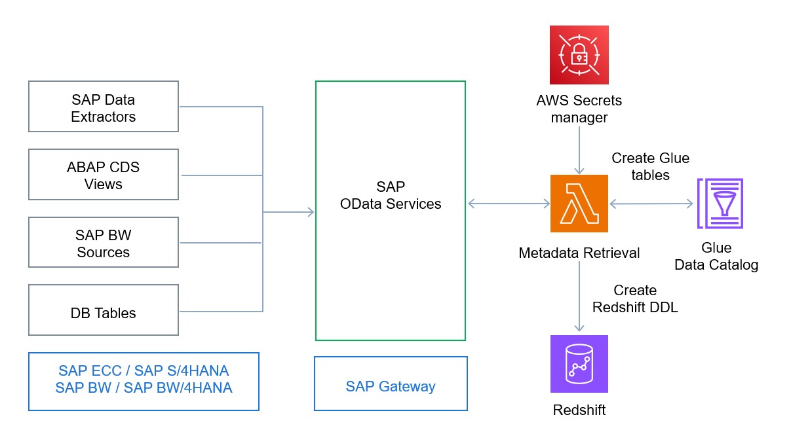

## SAP metadata discovery and metadata ingestion for Amazon Redshift

To make it easier for replicating the SAP metadata to Amazon Redshift and AWS Glue Data Catalog we've developed SAP metadata discovery tool. 

As per the architecture on left side, you have the various SAP data sources that are exposed as OData services to enable data ingestion. To have the data definition created in Redshift and also have business semantics about the data, we have created a lambda function that would crawl the SAP OData meta data and automatically generate the data definition in the respective schemas. Also, for semantic data discovery, we use this lambda to automatically catalog the data in the Glue data catalog.
In the Redshift case the Lambda will autogenerate the tables in respective schemas STG and DM.

## Pre-requisites

1) Redshift cluster created as indicated in the main README section
2) Create database and schemas using script db_and_schema.sql
3) Exposed the OData services for respective sources which will be configured in the config file
   
## Deployment Steps

1) Create new lambda function with python 3.12 and adjust the timeout to at least 5 min
2) Make sure Lambda is created in specific VPC
3) Load the lambda_function.py to your newly created Lambda
4) Within redshift_client code line adjust to proper AWS region where your deployment will take place
5) Adjust the Lambda IAM role and add inline policies for S3, Redshift Data API and Secret manager, make sure to add redshift.amazonaws.com into trust relationship. Adjust ARN to your specific resources used for S3, Redshift cluster and user as well as Secret Manager.
6) Copy the config.json file to respective S3 bucket
7) Provide all data sources and adjust config.json to your needs, as data sources exposed from SAP system 
8) Create username and password entries in AWS Secret Manager for your SAP system OData user, with name sap_odata_secrets, by secret keys as user and password
9) Define following Lambda environment variables
   1) BucketConfig - define in which S3 bucket is the config file located
   2) RedshiftClusterID - redshift cluster name 
   3) DBUSER - Redshift database user
   4) DATABASE - Redshift database name
   5) secret_name - secret name as defined in AWS Secret Manager 
   6) SAP_HOST - SAP system hostname
   7) SAP_PORT - SAP system port for OData services
10) Load and use redshift-ddl.zip as a layer for the lambda which will add PyOdata library in the python code
11) Execute the lambda
12) Validate results in the CloudWatch Log Stream